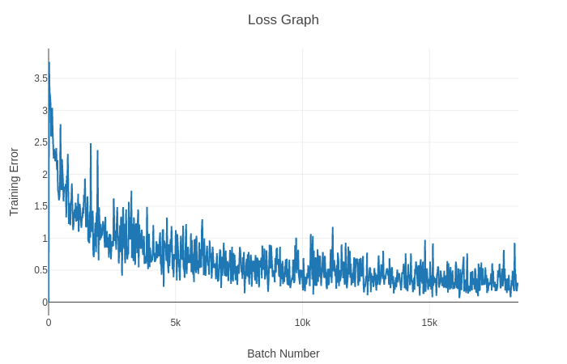

# PointNet in PyTorch

This is a PyTorch re-implementation of PointNet according to the specifications laid out in the paper with two minor differences:

 * I exclude the adaptive batch normalization decay rate
 * The trained model provided operates on pointclouds with 2000 points as opposed to 2048 (although you can re-train and change the pointcloud sizes)

### Other Implementations
 * The official TensorFlow implementation from the authors can be found [here](https://github.com/charlesq34/pointnet).
 * Another PyTorch re-implementation can be found [here](https://github.com/fxia22/pointnet.pytorch).

If you use my re-implementation for your own work, please cite the original paper:

```
Qi, Charles R., et al. "Pointnet: Deep learning on point sets for 3d classification and segmentation." 
Proc. Computer Vision and Pattern Recognition (CVPR), IEEE 1.2 (2017): 4.
```


---

## Repo TO-DO's
 * Finish segmentation implementation
 * Upload the sampled ModelNet40 data
 * Write up how-to section


---


## Classification Results

The pre-trained classifier model included in this repository was trained for 60 epochs with a batch size of 32 on a 2000-point-per-model sampling of ModelNet40.

#### Here is an graph showing the training loss over 60 epochs:




#### Below are the accuracy results for the included classifier model on the test set

| Overall Accuracy |
| :---: |
| 0.852917 |


| Dresser | Chair | Piano | Keyboard | Tent | Wardrobe | Bookshelf | Bed |
| :---: | :---: | :---: | :---: | :---: | :---: | :---: | :---: |
| 0.76 | 0.95 |0.83 | 0.90 | 1.00 | 0.65 | 0.95 | 0.92 |

| XBox | Vase | Table | Flower Pot | Cup | Glass Box | Night Stand | Sink |
| :---: | :---: | :---: | :---: | :---: | :---: | :---: | :---: |
| 0.70 | 0.81 |0.70 | 0.00 | 0.45 | 0.89 | 0.66 | 0.65 |

| Laptop | Airplane | Curtain | Range Hood | Stairs | Door | Radio | Bowl |
| :---: | :---: | :---: | :---: | :---: | :---: | :---: | :---: |
| 0.95 | 0.99 |0.80 | 0.91 | 0.65 | 0.85 | 0.70 | 1.00 |

| Toilet | Plant | Monitor | Lamp | Mantle | TV Stand | Car | Cone |
| :---: | :---: | :---: | :---: | :---: | :---: | :---: | :---: |
| 0.88 | 0.89 |0.94 | 0.75 | 0.89 | 0.79 | 0.91 | 0.85 |


| Bathtub | Bottle | Person | Stool | Bench | Guitar | Sofa | Desk |
| :---: | :---: | :---: | :---: | :---: | :---: | :---: | :---: |
| 0.82 | 0.96 | 0.85 | 0.60 | 0.85 | 0.91 | 0.97 | 0.80 |


